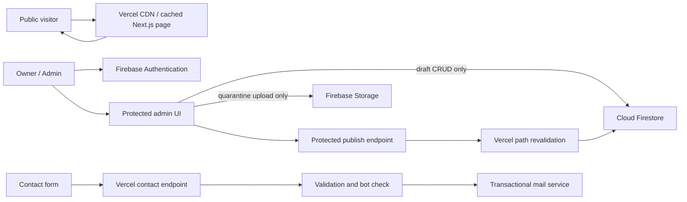

# Secure, Low-Cost System Architecture

Status: Planning baseline  
Project: Anugraha Pillai personal portfolio  
Last updated: 24 July 2026

## 1. Architecture goals

1. Public visitors must not connect directly to Firestore or Firebase Storage APIs.
2. A normal public page view should make zero Firebase API calls.
3. Public pages should be rendered and cached by Vercel's CDN.
4. Firebase is the private content-management source of truth, not the public delivery layer.
5. Only compressed, publication-ready media is stored in Firebase Storage.
6. Contact messages are validated server-side and sent through a mail provider; they are not stored in Firestore.
7. Browser draft operations are enforced by Firebase Security Rules. Every publication-state,
   settings, identity and destructive operation is performed by a least-privilege server endpoint.
   Firebase Admin SDK operations bypass Security Rules and must enforce authorization, validation,
   audit controls and least-privilege IAM in application code.

## 2. Selected stack

| Layer | Selection | Reason |
|---|---|---|
| Web application | Next.js (React) + JavaScript + Tailwind CSS/vanilla CSS | React-based JavaScript application with static generation, ISR, server endpoints and Vercel caching |
| Hosting and CDN | Vercel | Static asset delivery, HTTPS, preview deployments and cached page rendering |
| Admin identity | Firebase Authentication | One allow-listed owner account |
| Content database | Cloud Firestore | Managed source of truth for admin-managed content |
| Uploaded media | Firebase Storage | Used only for changing content uploaded through the admin panel |
| Stable visual assets | Git repository/Vercel | Logo, icons and fixed site assets consume no Firebase Storage |
| Contact | Vercel `/api/contact` + transactional mail provider | One controlled server call; no public mail credentials or Firestore write |
| Bot protection | Honeypot + minimum-submit-time check + Cloudflare Turnstile when required | Reduces spam without storing visitor data |

The mail adapter must be provider-neutral. Resend, Postmark, Amazon SES or another approved transactional provider can be selected through environment configuration without changing the contact form.

## 3. High-level flow



Public traffic normally terminates at the CDN. Firestore is read only when a page is first generated or regenerated after publication, not once per visitor.

## 4. Public rendering and API-call budget

### 4.1 Rendering model

- Use static generation for Home, About, Services, Contact and listing pages.
- Use static generation with incremental static regeneration (ISR) for blog, poster and research detail pages.
- On publish, unpublish, archive, delete, slug change or public-settings change, a protected server endpoint performs the mutation and invalidates the affected cache tags and paths.
- Do not include the Firebase browser SDK in the public application bundle.
- Do not use live Firestore listeners on public pages.
- Search initially uses a compact, CDN-cached search index generated from published titles, excerpts, tags and slugs.

### 4.2 Expected calls

| Action | Firebase calls |
|---|---:|
| Visitor opens an already cached page | 0 |
| Visitor searches after index is cached | 0 |
| CDN regenerates a detail page | 1 document read, plus required site settings read if not cached in the render |
| Admin opens a paginated content list | 1 bounded Firestore query |
| Admin saves a draft | 1 Firestore write |
| Admin publishes an item | 1 protected request; transactional content/reservation/job writes plus targeted cache invalidation |
| Admin uploads an image | Storage upload(s) only; metadata stays in the content document |
| Visitor submits contact form | 0 Firebase calls; 1 required bot-verification call + at most 1 idempotent mail-provider call |

All admin queries must use cursor pagination and explicit limits. No screen may fetch an entire collection merely to calculate totals.

## 5. Firestore model

Use separate collections because they produce simpler validation rules and predictable queries.

```text
posts/{id}
posters/{id}
research/{id}
services/{id}
pages/{pageKey}
settings/public
admins/{uid}
slugReservations/{typeAndNormalizedSlug}
publicationJobs/{id}
redirects/{typeAndOldNormalizedSlug}
```

Common publishable fields:

```text
id, title, slug, excerpt/summary, status,
featured, publishedAt, createdAt, updatedAt,
coverImage, tags, seo
```

Rules for the model:

- `status` is one of `draft`, `published`, `archived`.
- Document IDs are generated IDs. Slugs are normalized for Unicode, case and separators and reserved
  atomically in `slugReservations` in the same server transaction as publication.
- A published slug is immutable by default. An approved slug change creates a redirect and atomically
  moves the reservation; an old URL must never silently resolve to different content.
- Permanent deletion retains a minimal non-sensitive slug tombstone and returns `410 Gone`; the slug
  remains reserved and cannot later point to unrelated content.
- Browser clients may edit drafts but cannot transition publication status, set `publishedAt`, change
  public settings/feature selections, or write redirects, slug reservations or delivery state.
- Use server timestamps for `createdAt` and `updatedAt`.
- Keep category/tag names in the content document unless a separate managed taxonomy becomes necessary.
- Store image metadata in the owning content document; do not create a separate media document for every image.
- Store no dashboard counters initially. Obtain bounded counts only when needed or maintain counters transactionally after measured need.
- Contact messages are not stored in Firestore. The mail provider's delivery log and destination inbox provide the operational record.

Required composite indexes should be limited to actual screens:

```text
collection: status ASC, publishedAt DESC
collection: status ASC, featured DESC, publishedAt DESC
```

Add category/tag indexes only after the corresponding query is implemented. Avoid speculative indexes.

## 6. Firebase Storage minimization

### 6.1 What belongs in Storage

- Blog cover images and inline editorial images uploaded by the owner
- Poster display images
- Research cover images when required
- Changeable profile imagery

Logo, fonts, icons, placeholders and other stable design assets belong in the Git repository and are served by Vercel.

### 6.2 Upload policy

Images are resized and compressed in the browser for usability, then uploaded to a restricted
quarantine path. Before publication, trusted server processing decodes, validates and re-encodes the
image into approved WebP variants. Quarantine/source objects are deleted after successful processing
and are never publicly delivered.

| Media | Maximum long edge | Target format | Target size |
|---|---:|---|---:|
| Cover/profile | 1600 px | WebP | <= 350 KB |
| Poster display | 2000 px | WebP | <= 700 KB |
| Thumbnail | 480 px | WebP | <= 100 KB |
| Inline image | 1600 px | WebP | <= 350 KB |

- Save at most a display image and thumbnail per item.
- Generate both variants client-side in one editing session.
- Do not retain HEIC, TIFF, RAW or the source upload.
- Reject files server-side by successful decode, pixel dimensions, frame count, post-re-encode size
  and approved output MIME type; never trust filename extension or client-provided MIME metadata.
- Use deterministic paths: `content/{collection}/{documentId}/{assetId}-{variant}.webp`.
- When replacing an image, update the Firestore document first, then delete the old unreferenced object.
- Run a periodic orphan report before deletion; do not perform blind recursive cleanup.
- Set long-lived immutable cache headers on versioned filenames.

### 6.3 Public media delivery

- Firestore stores an internal Storage object path, never a permanent download-token URL.
- Generated pages use a same-origin, versioned URL containing the owner identity, such as
  `/media/{contentType}/{contentId}/{assetVersion}/{variant}`.
- The route resolves metadata server-side, verifies that the owner is `published` and `live`, and
  checks that the variant is public. Download variants additionally require `downloadEnabled`.
- The route never accepts a raw bucket path or trusts visitor-supplied metadata.
- Display media uses immutable revision URLs. Unpublish/archive/delete invalidates affected caches.
  Previously downloaded public files cannot be recalled; sensitive or embargoed media must never be published.
- Draft previews use authenticated, `private, no-store` media responses and never reuse public URLs.
- Vercel's CDN serves repeat requests, so a cached image produces no Firebase Storage download.
- Storage Security Rules can therefore deny anonymous reads without breaking public images.

## 7. Authentication and authorization

- Enable Email/Password authentication for the single owner account only and require MFA before launch.
- Disable end-user account creation/deletion in Firebase Authentication settings. Hiding sign-up in
  the UI is not a security control; create the owner through the console or Admin SDK only.
- Authorize admin access using both a Firebase custom claim (`admin: true`) and an `admins/{uid}` allow-list record where practical.
- Require recent authentication plus MFA before password/email changes, permanent deletion,
  ownership/security changes and destructive bulk operations.
- Admin routes verify the Firebase ID token server-side; route hiding is not considered security.
- Firestore and Storage rules deny access by default.
- Public application pages never depend on permissive Firestore rules because public data is delivered by Vercel-rendered pages.
- Use short session cookies with `HttpOnly`, `Secure`, and `SameSite=Lax` for server-protected admin routes. Revoke sessions during incident response.
- Rate-limit sign-in and password-reset attempts, use non-enumerating responses, notify the owner of
  password/email/MFA changes and document recovery-code and account-recovery procedures.
- Use separate least-privilege service identities for rendering/media and publishing/maintenance;
  do not distribute a broad service-account JSON key.

## 8. Contact mail architecture

`POST /api/contact` accepts only:

```text
name, email, subject, message, consent,
turnstileToken, idempotencyToken, honeypot, formStartedAt
```

Processing order:

1. Enforce POST, JSON content type and a small request-body limit.
2. Validate origin/host against the production and approved preview hosts.
3. Reject a populated honeypot or implausibly fast submission.
4. Validate and normalize all fields server-side with strict length limits.
5. Verify a single-use Turnstile token at launch. Disabling it requires a recorded risk decision.
6. Apply a documented WAF rate limit to `/api/contact` before the function executes, plus an
   application-level secondary limit and mail-provider quota/spending alerts. Where short-term abuse
   correlation is necessary, store only keyed hashes with a short TTL; never log raw IP addresses.
7. Escape all user content and render it as text in the notification email.
8. Send through the mail provider using a verified sender domain.
9. Set `Reply-To` to the validated visitor address; never use the visitor address as `From`.
10. Return a generic success/failure response without exposing provider details.
11. Accept an idempotency token per form attempt and suppress duplicate mail sends within a short TTL.

Recommended limits:

```text
name: 2-80 characters
email: <= 254 characters
subject: 3-120 characters
message: 10-5000 characters
request body: <= 16 KB
```

Provider API keys, Turnstile secrets and destination addresses remain server-only Vercel environment variables. Avoid logging message bodies or email addresses.

## 9. Security boundaries

### Browser-safe configuration

Firebase web configuration is not a secret, but it must be restricted to approved domains and protected by Security Rules. Only `NEXT_PUBLIC_*` values intended for browsers may be exposed.

### Server-only secrets

```text
FIREBASE_PROJECT_ID
FIREBASE_CLIENT_EMAIL
FIREBASE_PRIVATE_KEY
MAIL_PROVIDER
MAIL_API_KEY
CONTACT_FROM
CONTACT_TO
TURNSTILE_SECRET_KEY
REVALIDATION_SECRET
```

Use Vercel environment variables. Never commit service-account JSON or `.env` files.

### Application safeguards

- Apply a strict Content Security Policy with explicit `default-src`, `script-src`, `style-src`,
  `img-src`, `connect-src`, `frame-src`, `base-uri`, `form-action` and `frame-ancestors`. Use nonces or
  hashes where runtime scripts require them; do not permit broad wildcards or `unsafe-eval`. Roll out
  in report-only mode against preview, resolve violations, then enforce in production.
- Send HSTS, `X-Content-Type-Options: nosniff`, Referrer-Policy and Permissions-Policy headers.
- Sanitize rich content using an allow-list before saving and again before rendering.
- Prefer a structured block editor or Markdown over unrestricted HTML.
- Validate redirect targets and external URLs; add `rel="noopener noreferrer"` where appropriate.
- Protect mutation endpoints against CSRF using same-site cookies plus origin validation.
- Do not expose stack traces, Firebase errors or mail-provider responses to visitors.

## 10. Publishing transaction

1. Admin authenticates and edits a draft through bounded Firestore operations.
2. Client validates media and uploads optimized variants directly to the restricted Storage path.
3. Admin requests publication through the server; the browser cannot make the status transition.
4. Server verifies the session, MFA/recent-auth requirement where applicable, allow-list state,
   schema, atomic slug reservation and trusted processed-media references.
5. A transaction writes an immutable content revision and a `publicationJobs` outbox record with
   `deliveryState: pending`; retries use a stable idempotency key.
6. The job invalidates precise content/list/Home/search/sitemap/media cache tags and verifies that the
   regenerated result does not expose drafts or stale metadata.
7. Only after successful delivery verification does the server set `deliveryState: live`. Failure
   remains `pending` or `failed`, retries with backoff and raises an operational alert.
8. Unpublish/archive uses the same workflow and prioritizes removal from public indexes and caches.

The UI distinguishes saved draft, publication pending, live and publication failed. Database
`status` alone is never presented as proof that public delivery succeeded.

## 11. Backup, monitoring and recovery

- Git and Vercel retain application revisions independently of Firebase.
- Define production RPO/RTO before launch. Baseline: daily Firestore export, daily media backup to a
  separate restricted location and 30-day retention with encrypted access controls.
- Keep a manifest of Storage paths, checksums, sizes and owner IDs; a manifest is inventory, not backup.
- Restore into a non-production project before launch and at least quarterly; record elapsed restore
  time, missing objects and corrective actions.
- Configure Firebase and Vercel billing/usage alerts before production.
- Monitor contact endpoint failure rate and mail-provider delivery events without logging message content.
- Configure and document inbox/mail-provider retention, deletion access and data-processing terms;
  provider delivery logs are personal-data records, not a substitute for an approved retention policy.
- Recovery order: disable publishing, revoke the admin session, rotate affected secrets, roll back Vercel, restore/repair data, then re-enable publishing.

## 12. Explicit exclusions from the baseline

- No public Firestore listeners
- No Firestore-backed contact inbox
- No visitor accounts
- No unrestricted HTML editor
- No original-image archive
- No full-library fetch for search or admin dashboards
- No third-party hosted search until the content volume proves it necessary
- No automatic image transformation service unless bandwidth measurements justify it

## 13. Decisions required before implementation

1. Select the transactional mail provider and verify its sender domain.
2. Confirm whether poster downloads need a higher-resolution optional asset; the default architecture stores display resolution only.
3. Confirm contact-message retention expectations in the destination mailbox and mail provider.
4. Approve Next.js as the React framework so ISR can provide zero-Firebase-call public page views.
5. Confirm Turnstile launch configuration. It is required by this baseline; deferral requires an
   owner, expiry date, compensating WAF limits and written acceptance of spam/mail-cost risk.

## 14. Draft preview and cache invariants

- Draft preview routes require an active admin session; a bare document ID is never authorization.
- Preview pages/media send `Cache-Control: private, no-store` and `X-Robots-Tag: noindex, nofollow`
  and are excluded from sitemap, search and social metadata.
- Public queries require both `status == published` and `deliveryState == live`.
- Cache invalidation uses revision/content tags as the primary mechanism and paths where required;
  tests cover old slugs, Home, search, sitemap, media and Open Graph output.
- Draft values must not enter a shared cache key, public error report or public media URL.

## 15. Search architecture and limits

- Launch search covers normalized title, excerpt/summary, tags, topic and slug. Body full-text search
  is excluded until a dedicated search service is approved.
- Generate the index server-side from `published + live` revisions only and invalidate it through the
  publication job. Never build it by fetching all records in a visitor request.
- Baseline compressed-index limits are 250 KB and 2,000 records. Reaching either threshold triggers a
  move to server-paginated or hosted search after privacy/security review.
- Search counts cover the searchable corpus and must not cause unbounded Firestore reads.

## 16. IAM and audit precautions

- Read-only runtime identity: read published/live content and approved public media only.
- Publishing identity: validated publication transactions and cache invalidation only.
- Maintenance/backup identity: separate non-runtime credential with documented custodians.
- Record login outcome, publication transition, slug/settings changes, media promotion and deletion
  without copying rich content or secrets. Browser clients cannot write audit events.
- Retain security audit events for 90 days initially, subject to the approved privacy policy.
